# Vectorization benchmark

We ran a series of tests to compare the performance of the vectorization API
present in this branch to that of the current code.
The tests can be run using

```bash
    ./gradlew allBenchmark
```

or the more specific commands such as

```bash
    ./gradlew softmaxBenchmark
```

### Environment

Building this project requires the [vector-test branch](https://github.com/JetBrains-Research/kinference-primitives/tree/vector-test)
of kinference-primitives published to Maven Local.
The tests have been run on a laptop equipped with an Intel(R) Core(TM) i9-12900H(20)
, supporting the AVX-2 instruction set on 256 bits registers.

### Results

The performance has been measured using the number of operations per seconds on NDArrays
of different sizes. In benchmarks regarding dot products, the input arrays have
shape equal to $\texttt{size} \times \texttt{size}$. In all other cases the shape is
$\texttt{size} \times \texttt{size} \times \texttt{size}$ instead.

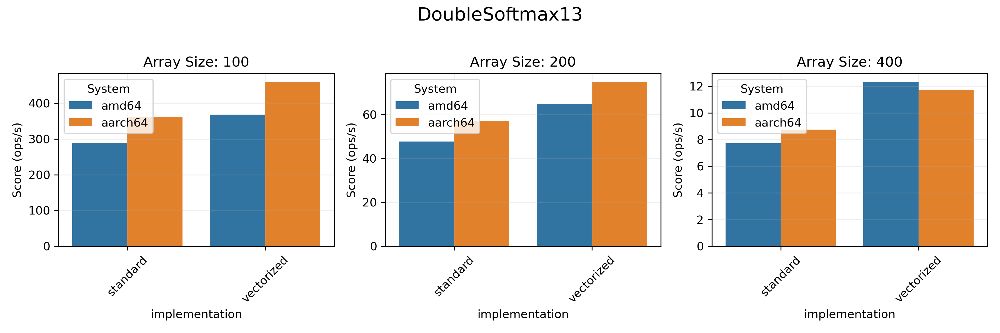
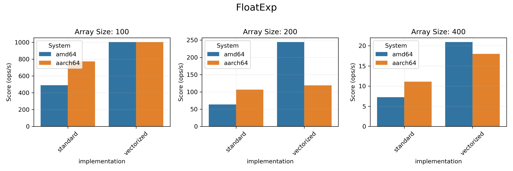
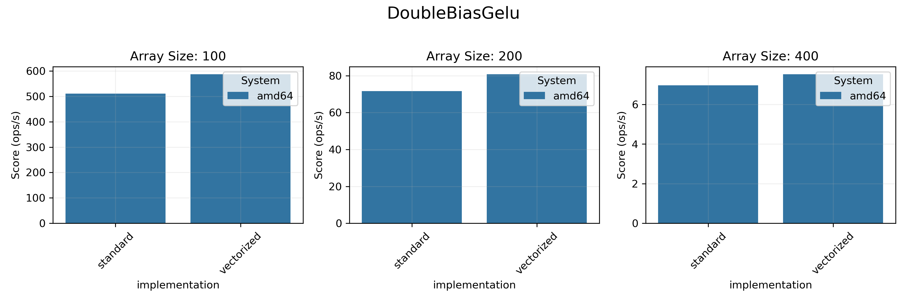
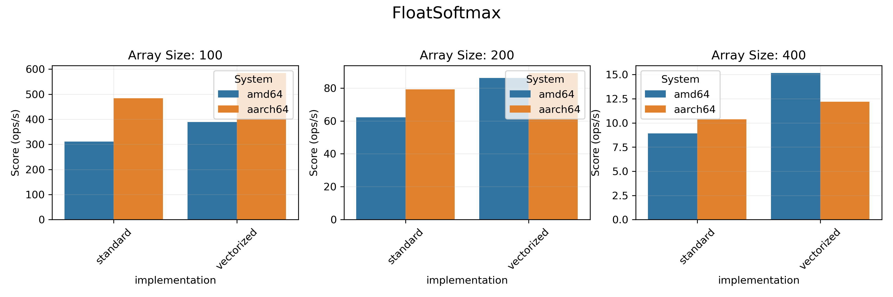
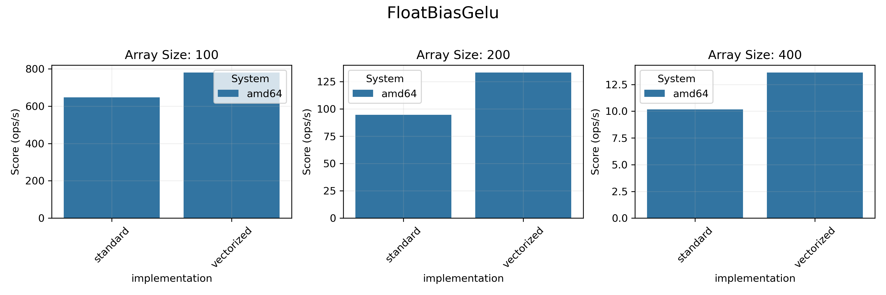
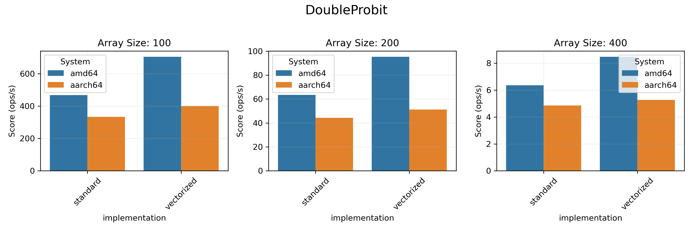
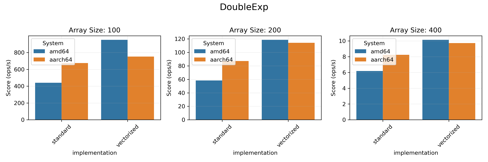
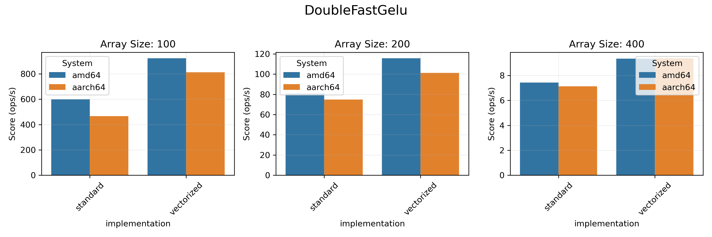
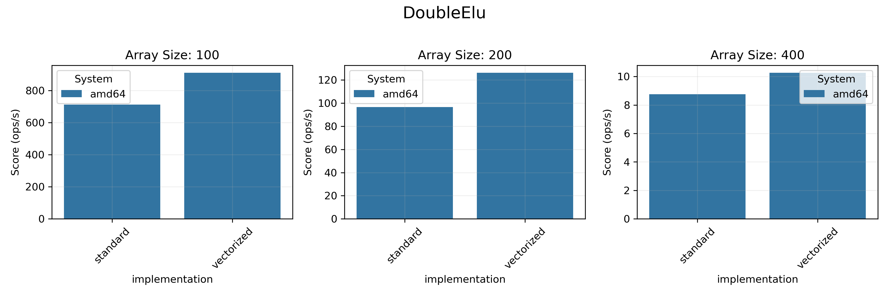
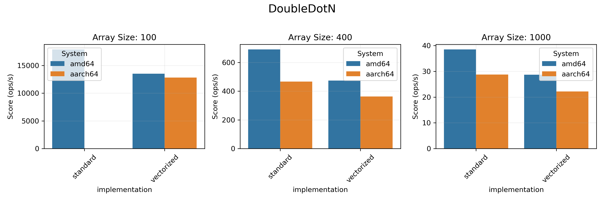
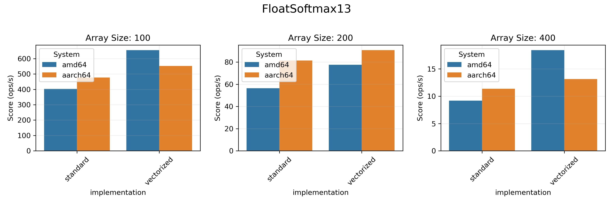
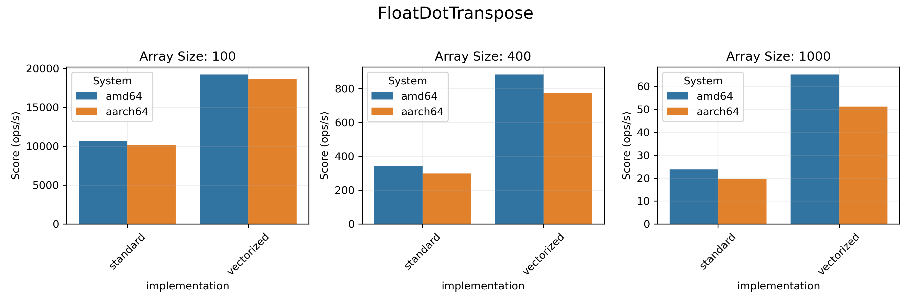
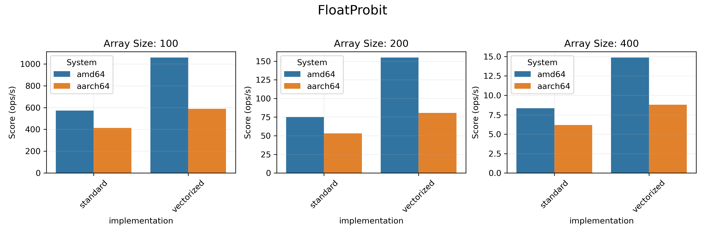
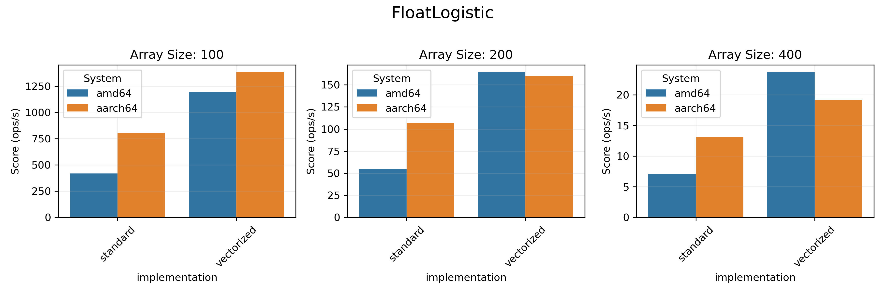
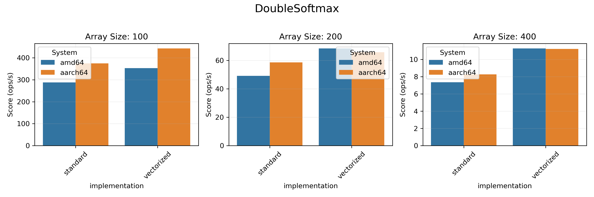
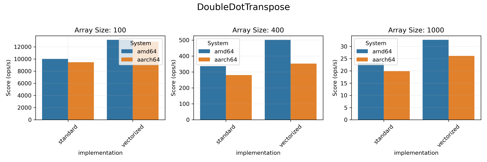
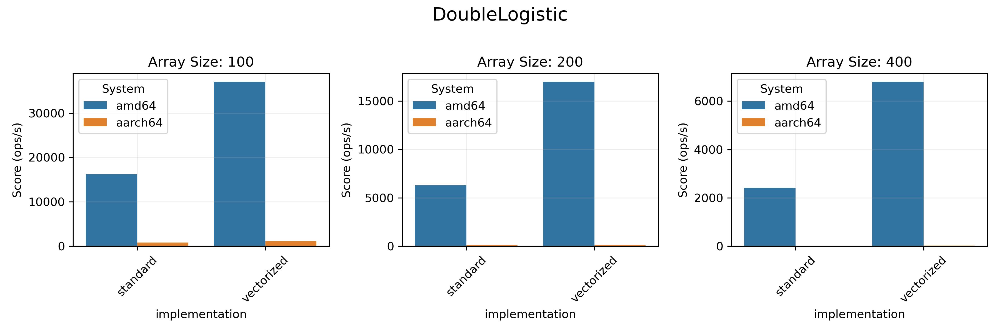
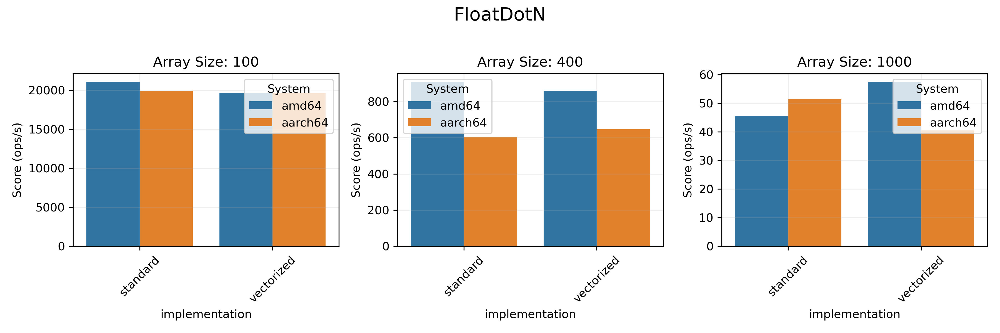
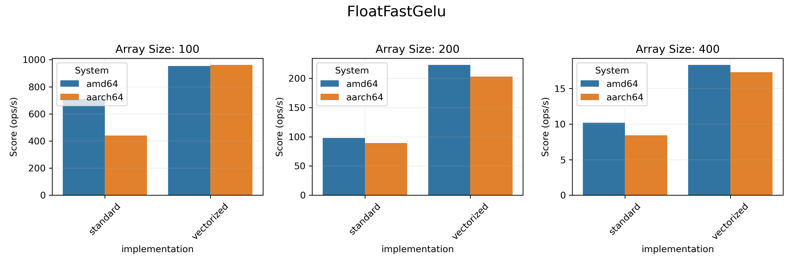
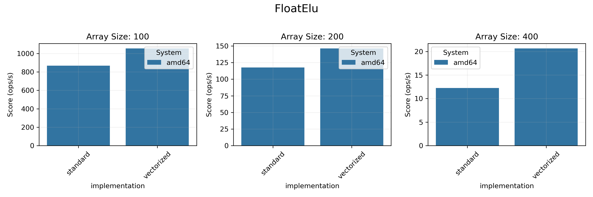
